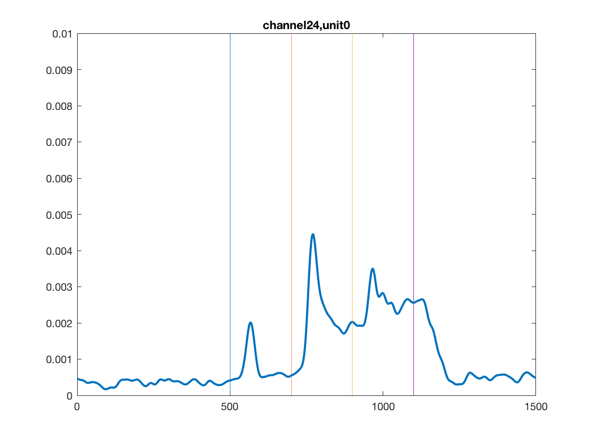

# 800Experiment

Familiarity,  Contextual Modulation, Prediction, Sharpening  and Functional Connectivity.

This series of experiments has multiple purposes.
1. It evaluate sharpening effect with familiarity with 200 stimuli instead of 25 stimuli. 
2. It evaluates the prediction hypothesis, to see if small aperture stimuli, after training, will be associated or predictive of the scenes of the larger aperture.
3. Then, after training, we will test the the functional connectivity of the neurons to see if there is any change due to training.

====================================

Stage 1:  Scanning.
May 14 and May 15 
First, it scanned the 800 stimuli  at RF (1, -1) in Aim 2.1 design, i.e. stimuli was first presented in 2-degree aperture for 200 ms, 4-degree aperture for 200 ms, and then 12-degree aperture.  Each day, 5 blocks are tested, so we will need to combine data from the two days.  Hopefully the cells are the same, but we can check their tuning correlation. 

*Note. The 800 stimuli are the top 40 stimuli of electrodes 2 6 8 12 17 41, 31, 33, 34, 36, 39. From March 8000 scanning. There is no guarantee that these are the best stimuli for these electrodes. 

This will give us a pre-training assessment of the neurons’ responses in this paradigm. 
With this paradigm,  for neurons with RF centered  within the 2-degree aperture, we expect the neurons will respond to the smallest aperture, and when the larger aperture appears, the neurons will respond even though nothing appears in the receptive fields, this additional response is pure contextual modulation. This paradigm allows us to separate the feedforward computation (response to the first aperture), and the contextual modulation (the response to the appearance of the second and third apertures).

Run by cnn400.set, with cnn800c.itm (5B), and then cnn800d.itm (5B_) 
ga2018_05_14_001.    Cnn800c.itm (5B)
ga2018_05_14_002.    Cnn800d.itm (4B)
ga2018_05_14_003.    Cnn800d.itm (1B)
RF (1, -1).

====================================

Stage 2: Training.
The 800 stimuli were separated into 8 files, 100 stimulus in each file.  Set 1 contains 1, 9, 17, .. 392 (50 of them) and 401:8:792
Set 2 contains 2, 10, … 393 (50 of them) 402:8:793. etc. 

May 16.   Use cnn100.set. with  cnn100D1.cnd. 
ga2018_05_16_001.    Cnn800c.itm (10B).  Each one has 100 conditions. 1st 50 from set 1, 1st 50 from set 2.
ga2018_05_16_002.    Cnn800d.itm (10B).  2nd 50 from set 1, 2nd 50 from set 2.
ga2018_05_16_003.    Cnn800c.itm (10B)
ga2018_05_16_004.    Cnn800d.itm (10B)
The net result is that we tested 200 stimuli. No guarantee these are the best stimuli for any neurons.

May 17,18, 21,22, 23, 24, 25
Repeat May 16 experiments, training 200 familiar. 

A a result, we have 8 days of training, actually 170B of training of the familiar set, and 10B of novel sets. 

===================================================

Stage 3: Testing familiar versus novel.  Check sharpening. Prediction. 

May 29.  Use cnn100.set (or cnn200.set more appropriately)  with cnn100te.cnd.  
100te has 200 conditions, to be used with cnn800c.itm, and cnn800d.itm.
In these 200 conditions,  first 100 condition are “familiar”, trained, belong to the cnn800c.itm’s set 1 and set 2, the second 100 conditions are “novel”, drawn from set 3 and set 4, the first 50 of each.
When ran with cnn800d.itm,  the first 100 conditions are “familiar” trained, the second 100 conditions are novel, drawn from set 3 and set 4.
Set 3 has 100 novels divided into c and d itms, and so are set 4.

Essentially, May 29, we compare 200 familiar against 200 novel, and each run for 10 repetitions.
Later, TS saved this cnn100set with the new conditions into cnn200.set.

ga2018_05_29_001.    Cnn800c.itm (10B).  Each one has 200 conditions. 1st 100 from trained, second 100 novel. 
ga2018_05_29_002.    Cnn800d.itm (10B)

May 30.  Repeat May 29, with using  cnn100t2.cnd.   (that is using set 5 and 6 as the 200 novel conditions).
Still try to compare 200 familiar against 200 novel.

===============================================
Stage 4: Testing Functional Connectivity (using triplets).

May 31.  Testing for functional connectivity.
Summer chose 20 stimuli from familiar set, and 20 stimuli from novel set. Each stimulus will excite at least 3 neurons with responses above 5 percentile. Each stimulus is repeated 100 times.

ga2018_05_31_001.    Fam40.set, fam40.cnd.   95 repeats
ga2018_05_31_002.    Fam40.set, fam40.cnd.    5 repeats

Sorted by Stephen.

June 6:  Repeat May 31.  But move electrodes before repeating the experiment. 

ga2018_06_06_001.    Fam40.set, fam40.cnd.   60 repeats

To be sorted by Jingyuan.

============================

Stage 5: Checking position invariance of the familiar effect.

June 8:  After moving electrodes again, test cnn200.set ( cnn100te.cnd) again but with RF at (0.5, -1). 

ga2018_06_07_001.    cnn800c.itm. (10B)
ga2018_06_07_002.    cnn800d.itm  (10B)

This day, the cable 1 might be noisy.  Seems to have more noise. 

=====================================

Go back to Stage 3. Testing  familiar versus novel. Sharpening but with set 7 and set 8 stimuli as novel. 

June 11:
Cnn200.set.   cnn100t3.cnd 

ga2018_06_11_001.    cnn800c.itm. (10B)
ga2018_06_11_002.    cnn800d.itm  (10B)

The noise problem seems to fixed itself. 

======================================

Stage 6:  Testing novel and familiar but using the largest aperture only, no sequential three aperture paradigm (Aim 2.1).

June 14:
Cnn200b.set (with cnn200b.tm) with cnn100te.cnd.     The timing file is modified to display test 1 only. 
The Cerebus mirror monitor is on, probably ok.

ga2018_06_14_001.    cnn800c.itm. (10B)
ga2018_06_14_002.    cnn800d.itm  (10B)

June 15. Electrodes moved. Run again. 
Cnn200b.set (with cnn200b.tm) with cnn100te.cnd. 

ga2018_06_15_001.    cnn800c.itm. (8B).  (These 8 B threshold low low, maybe ok with Francis cell sorting). 
ga2018_06_15_002.    cnn800d.itm  (10B). (Signals good).
ga2018_06_15_003.    cnn800c.itm. (5B)

June 18.
Cnn200b.set (with cnn200b.tm) with cnn100t2.cnd.  testing with Day 5 and 6 novels. (Set 5 and set 6?)

ga2018_06_15_001.    cnn800c.itm. (10B).  (Maybe have some problems)
ga2018_06_15_002.    cnn800d.itm  (10B). 
ga2018_06_15_003.    cnn800c.itm. (5B).  

=====================================

